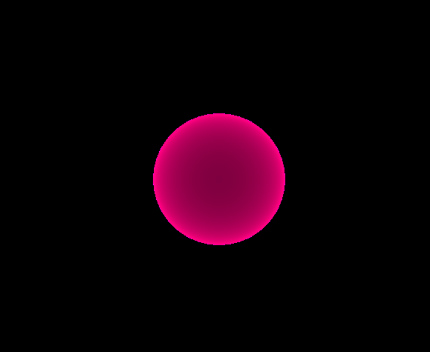
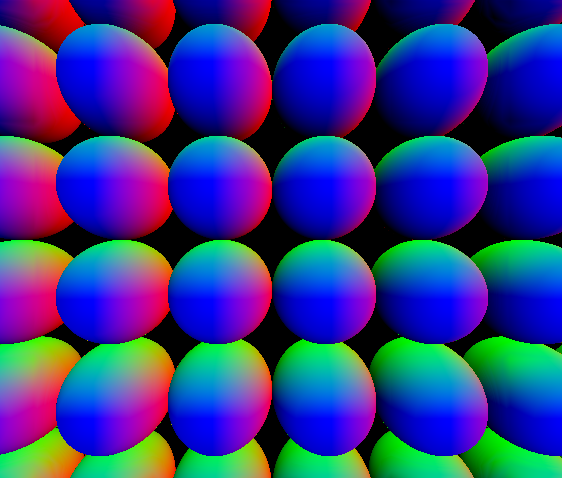
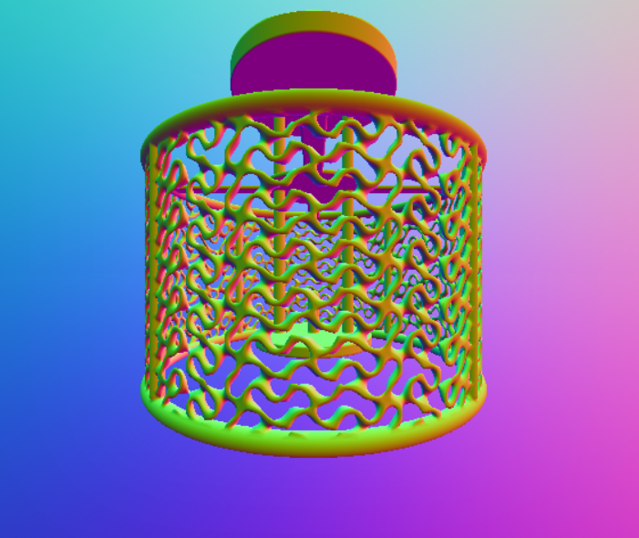

# RayMarch

A repository for ray marching tutorials and code. Code is provided under an MIT license.

I received a grant for 5 weeks to teach two students the fundamentals of ray marching from the ground up. I challenged them to gather resources, watch videos, and find holes in those resources. Our goal was to produce tutorial content to then teach ray marching to other students in the future. They decided to make videos! This page lists links to the shaders we created as well as to other content that we deemed useful to pull these students up to speed. They had no math background or graphics knowledge before we began, so if they can do it - you can too!

The video tutorial focuses on using shader toy to teach you the fundamentals. Because of that, I decided to use another resource to provide some variety. The resource I choose is https://glsl.app. When moving to writing your own fragment shaders in a standalone application, glsl.app will be just a tad closer. Another advantage is that it can be set to compile on edit.

I wrote the following fragment shader by watching the student's first ray marching segment and adapting to my style. I tend to comment more than the students but I also tended towards using more common variable names. Your mileage may vary and my hope is that the combination of the resources is more beneficial than just one.

You can check out the fragment shader from the first coded segment on raymarching [First Fragment Shader](first.frag).

Turns out this display mode is also useful in debugging. By looking at the "depth map" directly, you can sometimes determine if your transforms are working the way you had intended.

At the end of that segment, Bryce has some fun and adds some motion to the sphere via the time parameter. You can check that out here [Second Fragment Shader](second.frag).

Caleb enters the fray in the fourth segment and walks us through some of the neat hacks that allow for instancing of data - without actually duplicating the sdf. A single call to the sdf for a sphere as well as some clever manipulation of data, gives the image below. This is rendered via normals that are numerically computed based on the map. This render is another useful debug default rendering style that we can use if needed. You can check out the fragment shader I wrote based on the segment here [Third Fragment Shader](third.frag).

That fourth fragment shader was a lot of extra typing! But that's okay, I've duplicated a lot of that work here. The SDF functions that CAleb uses can be found on IQ's pages listed below if he did not show them in his video. But you can take them from my fragment shader as well. Caleb didn't talk about how he's getting his normals, but I mentioned that in my segment. Feel free to copy that code out of my fragment shader as well. [Fourth Fragment Shader - The Lamp](fourth.frag)

# Other things!
We got to much more this summer than the tutorial video shows. They implemented clouds and heightmaps. They dove into reflections, refractions, fresnel, hard shadows, and soft shadows!  They had a few artistic and rainbow pop explorations. It is always great to have fun with it when you're learning - so don't be afraid to experiment and have a good time. If you poke around Caleb and Bryce's shadertoy, you'll bump into a few of those experimentations.

# Links to other Content!

Firstly, we can't be where we are today without standing on the backs of giants. There are too many to name. But thank you. If you have useful resources I should link here, please do let me know.  I'm happy to push the best educational and inspirational materials out as I can.

So, there are lots of great resources from those that came before.

Let's start with a giant who both inspired and frustrated us! Inigo Quilez has a wealth of topics and articles on his website (and shadertoy) that are useful to anybody starting out. We were inspired by his youtube video here: [Inigo Quilez's Mathematical Landscape Video](https://www.youtube.com/watch?v=BFld4EBO2RE&t=1s) but we wanted to offer up a little more help to get users on their feet. If you're going to get into computer graphics, chances are you'll bump into more of his stuff - as we did [Inigo Quilez's Website](https://iquilezles.org/)

Art of Code over on youtube inspired Caleb to dig at Gyroids and include them in his lamp. Specifically this video is a place where he does an investigation and a series of experimentation [Art Of Code's Gyroid Video](https://www.youtube.com/watch?v=-adHIyjIYgk)

Kishimisu has a tutorial that any ray marching art-inspired person should watch. They do a great job of breaking down what ray-marching is with a lot of high-quality visualizations. [Kishimisu's Ray Marching Video](https://www.youtube.com/watch?v=khblXafu7iA)

Michael Walczyk's blog was useful for Bryce in a condensed tight package that explains ray marching [Michael Walczyk's Blog Post](https://michaelwalczyk.com/blog-ray-marching.html)

# Our Shaders

- [My Raymarcher Explainer](https://www.shadertoy.com/view/Wfc3z2) P switches to 3D, H resets, T toggles the "screen", R widens the screen, WASD and Arrow keys do movement, F toggles movement of eye position vs. the screen position
- [My Lambertian Positional/Directional Explainer](https://www.shadertoy.com/view/wft3Ws)
- [My Specular and multi-light Demn](https://www.shadertoy.com/view/tfdGDs)
- [Caleb's Refraction Study](https://www.shadertoy.com/view/wcVGR3)
- [Caleb's Lamp](https://www.shadertoy.com/view/tfcSW8)
- [Bryce's Ball of Glow](https://www.shadertoy.com/view/WctXzN) 

# Other Useful Resources

- [SDF Functions](https://iquilezles.org/articles/distfunctions/) from IQ
- More To Come
  

